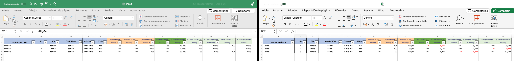
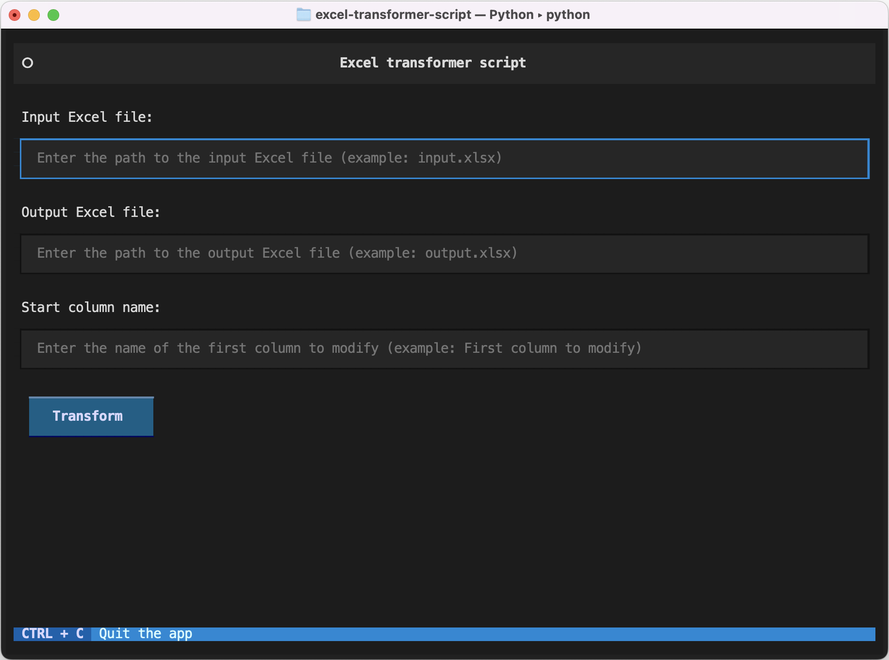
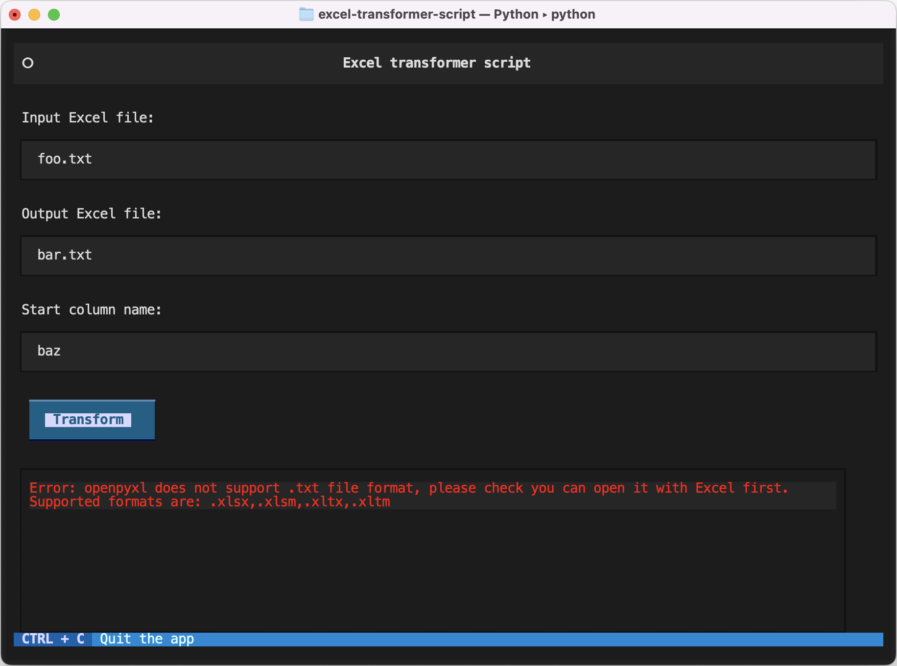
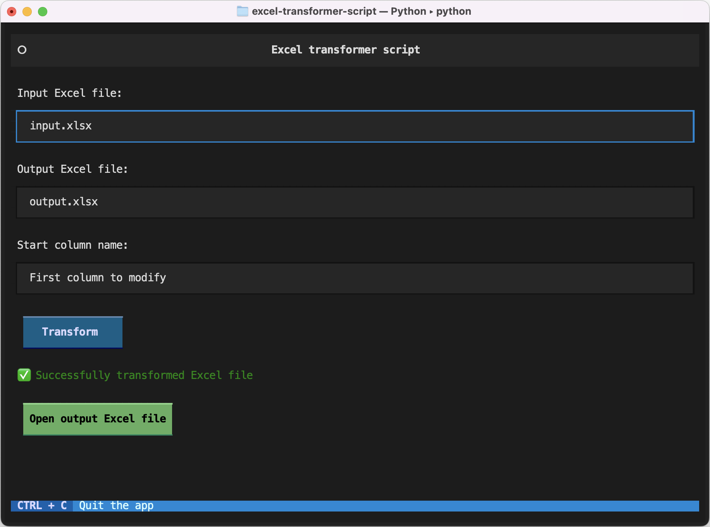

# Excel transformer script



The `excel-transformer-script` project is a Python-based tool designed to modify Excel files through a terminal-based user interface.

Utilizing the `openpyxl` library for Excel file manipulations and the `textual` library for creating an interactive terminal UI,
the script performs specific data transformations while preserving cell formatting and colors. It adjusts integer and percentage pairs in the spreadsheet,
setting values below 100 to zero and marking these changes with red text. The user interface guides the user to input the necessary parameters,
streamlining the transformation process for enhanced usability.

## Steps to execute

There are 2 scripts:
* `script.py`: Only contains the Excel transformation logic. If you don't want to interact with the UI, you can use this script.
  1. Edit the following variables inside the script:
     - `input_excel_file`: Name of the input excel file (example: `input.xlsx`)
     - `output_excel_file`: Name of the output excel file (example: `output.xlsx`)
     - `start_column_name`: Name of the first column from which transformations should be made (example: `Eventos GFP+ (CD45+)`)
  2. Execute the script with the following commands:
	 ```shell
	 pipenv shell
	 pip install openpyxl
	 python script.py
	 ```
* `script-ui.py`: Uses `textual` library to show a UI inside the terminal, improving user experience.
  1. Execute the script with the following commands:
	 ```shell
	 pipenv shell
	 pip install openpyxl textual
	 python script-ui.py
	 ```
  2. Specify the values that the UI asks for

## UI Screenshots

  
  
  
